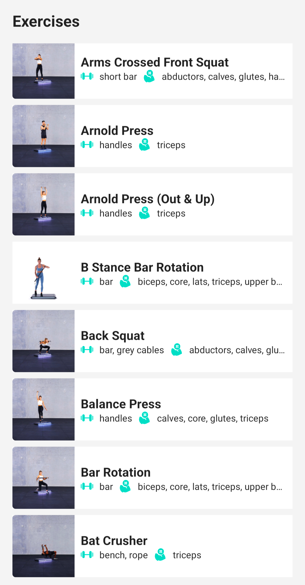

# Android Challenge demo app

### Main technologies

Used Retrofit2, Dagger2, LiveData, Compose, Coroutines

### Short description and notes

The app has only demo purposes. Fetches and displays a list of exercises with the main info:
a thumbnail, a title and main traits.
Even though the app currently lacks a lot of valuable features to simplify this demo, the project also
contains some "non necessary" logic (like this kind of DI) to demonstrate how the code could be written for the real world app

### Possible further improvements

* Add new API endpoint and implement pagination
* Display not only the first thumbnail but all of them (e.g. add an animation)
* Currently, to simplify the app, only one `AppModule` was used. The dependencies might be moved to separate ones according to the functionality
* For DI could be used multibinding if the app will be growing and scaling
* Add initial loading during the network call
* Add pull-to-refresh functionality
* etc

### Screenshot

